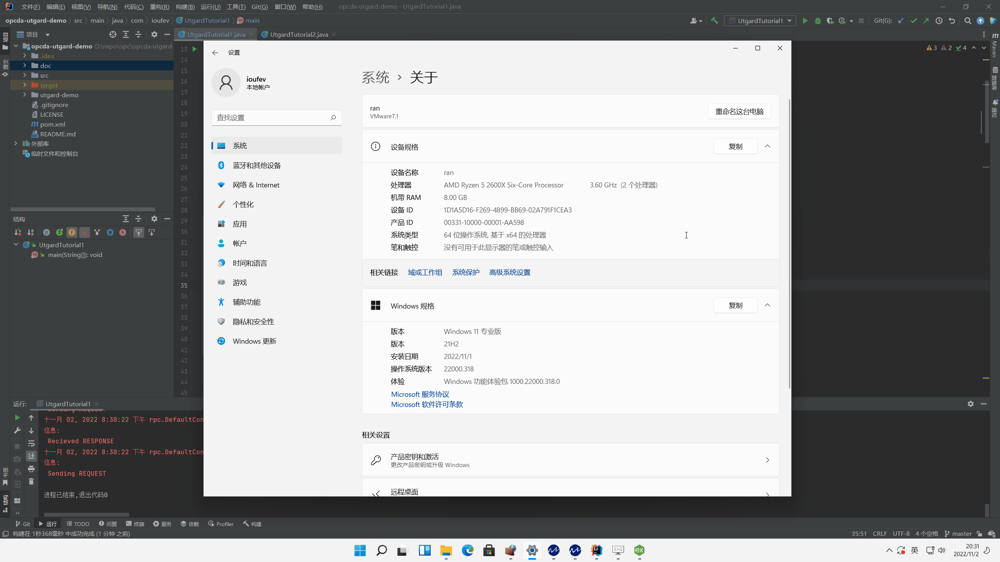

Java实现OPC通信

原来代码使用 STS（spring 推出的，带 spring 插件的 eclipse）写的代码

这几天使用 IDEA 测试了一下原来的代码

关于 Windows 更新了 DCOM 补丁，使 Utgard 连接不上，暂时好像也没什么好办法。

[微软 DCOM 补丁对 OPC Classic 客户端和服务端的影响](https://www.cnblogs.com/ioufev/articles/16849462.html)

读取数据

